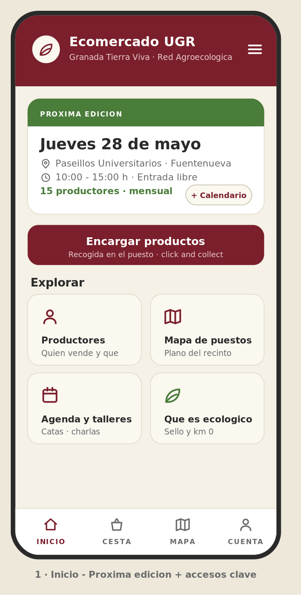
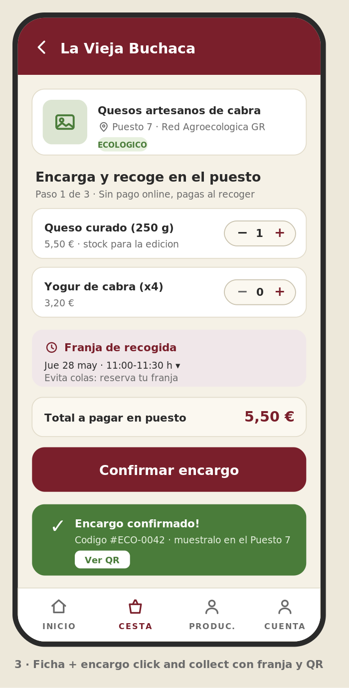

# Trabajo final DIU 2025/26 — Portfolio UX y caso de estudio ECOMERCADO UGR

**Autor:** Pablo Antonio Caballero Carmona
**Asignatura:** Diseño de Interfaces de Usuario · Lenguajes y Sistemas Informáticos · E.T.S.I. Informática y de Telecomunicaciones · Universidad de Granada
**Proyecto de prácticas de referencia:** *Anime Ramen / Ghibli Experience* (grupo DIU1.HustleHard)

---

## PARTE I · Mi experiencia UX

### Punto de partida

Esta asignatura ha sido mi **primera toma de contacto** con el mundo del diseño de interfaces y la experiencia de usuario, así que parto de la base de que casi todo lo que cuento aquí lo he aprendido este curso. Mi experiencia se ha construido sobre un proyecto que llevamos de principio a fin: el rediseño de **Anime Ramen**, un restaurante temático inspirado en el universo de Studio Ghibli. A lo largo de las cinco prácticas recorrimos el ciclo completo de **diseño centrado en el usuario**: entender al usuario, definir qué necesita, proponer una solución y, por último, ponerla a prueba. Lo que más me llevo no es haber aprendido técnicas sueltas, sino entender que **cada paso alimenta al siguiente**: lo que descubres investigando condiciona cómo organizas la información, eso marca el diseño visual, y la evaluación final te dice dónde te has equivocado. A continuación valoro mis aportaciones por fases, explicando qué aporté y por qué, no solo qué hice.

### Investigación (Práctica 1)

En la primera fase mi contribución se centró en convertir intuiciones en datos. Más allá de redactar el plan de investigación, lo que considero una aportación de calidad fue **fijar objetivos con métricas concretas** (cuántas reservas se completan, satisfacción del usuario, tiempo en la galería de platos): un objetivo que no se puede medir no sirve para tomar decisiones, y esa idea —que la usabilidad hay que poder medirla— me acompañó durante todo el curso.

De lo que estoy más satisfecho es del diseño de las **dos personas**: Alejandro, un ingeniero metódico que valora la rapidez y la eficiencia, y Martina, estudiante de Bellas Artes que busca ambiente, calma e inspiración. No las planteé como fichas de relleno, sino como **dos formas opuestas de usar el restaurante**: uno quiere reservar rápido, la otra quiere una experiencia que la atrape. Esa tensión fue muy útil, porque obligó a que cada decisión posterior funcionara para los dos perfiles y no para un "usuario medio" que en realidad no existe. Al principio me costó entender para qué servía "inventarse" usuarios, pero según avanzaba el proyecto me di cuenta de que tenerlos delante ayudaba muchísimo a frenar discusiones de gusto: en vez de "a mí me parece mejor así", la pregunta pasaba a ser "¿esto le sirve a Alejandro o a Martina?". En el **análisis de la competencia** (frente a Ramen Dojo y Ramen Shifu) y en la **revisión de usabilidad** de Ramen Dojo aporté rigor cambiando el "me gusta / no me gusta" por una valoración con nota (66/100) y por señalar fallos concretos —navegación poco consistente, falta de buscador, formularios que no avisan al usuario de lo que pasa— apoyándome en las **heurísticas de Nielsen**. Ese hábito de justificar cada crítica con un criterio claro es justo lo que pide este examen.

### Diseño y organización de la información (Práctica 2)

En la segunda práctica trabajé el salto de "qué problema resolvemos" a "cómo lo estructuramos". Mi aportación principal fue el **Scope Canvas**, donde definí la propuesta de valor —reservar por "biomas" según el estado de ánimo del usuario— uniendo lo que necesita el usuario con lo que busca el negocio. También participé en la **matriz de tareas**, donde priorizamos las funciones para cinco tipos de usuario; eso nos permitió decidir con criterio qué era lo más importante (el flujo de reserva) y, por tanto, a qué dedicar más esfuerzo.

En la **organización de la información** (sitemap y nombres de las secciones) el aprendizaje clave fue que **las etiquetas tienen que hablar el idioma del usuario**, no el del diseñador. Y los **wireframes los planteamos pensando primero en el móvil** (*mobile-first*), una decisión justificada: el usuario consulta y reserva desde el teléfono, así que diseñar primero la pantalla pequeña obliga a ordenar bien lo importante. Este enfoque vuelve a aparecer en la Parte II.

### Diseño visual y sistema de diseño (Práctica 3)

Esta fue la práctica más exigente y donde más aporté a nivel técnico. A partir de un **moodboard** que fijó el estilo, montamos un **sistema de diseño** completo: una librería de componentes reutilizables (botones, tarjetas, formularios…) que se combinan entre sí, lo que permite mantener la coherencia sin rediseñar cada pantalla. Mi aportación más concreta fue tratar el **color como algo funcional y accesible**, no decorativo: comprobé los contrastes para que el texto se lea bien (alcanzamos un contraste de 13:1, muy por encima del mínimo que pide la accesibilidad) y diseñé un **código de color por bioma** que ayuda al usuario a orientarse de un vistazo. También aposté por patrones que reducen el esfuerzo del usuario: el **flujo de reserva en cuatro pasos**, que evita abrumar mostrando todo de golpe; el **acordeón** de las preguntas frecuentes; y un **mapa de mesas con colores** que dejan claro qué está libre y qué ocupado. El resultado fue un *mockup* de alta fidelidad coherente en sus siete pantallas, lo que demuestra que el sistema cumplió su función. Esta fue, además, la fase en la que más disfruté: ver cómo unas decisiones que parecían pequeñas (elegir bien dos colores, fijar unos tamaños de texto, repetir un mismo botón en todas partes) acababan dando una sensación de producto serio y terminado fue muy satisfactorio, y me hizo entender el valor de trabajar con un sistema en lugar de ir maquetando cada pantalla por separado.

### Programación y evaluación (Prácticas 4 y 5)

En la **exportación a código** pasé el diseño de Figma a una web funcional con **React**, manteniendo la misma lógica de componentes reutilizables y documentándolos para que el equipo pudiera consultarlos. Aquí lo valioso no fue solo "programar", sino **resolver problemas reales** que la teoría no anticipa: incompatibilidades entre versiones de herramientas y un fallo al publicar la web que tuve que investigar y solucionar. Comprobar que un color o un estilo definido en el diseño se traslada fielmente al código cierra la distancia entre diseñar y construir, que es uno de los retos de verdad de esta disciplina.

La **evaluación** fue lo que más me cambió la forma de pensar. Montamos un estudio comparando dos propuestas con usuarios reales, usando un test A/B, el **cuestionario SUS** (una nota estándar de usabilidad) y *eye tracking* (seguimiento de la mirada). Nuestra propuesta sacó un **SUS de 78,5**, una buena nota, pero lo realmente útil fueron los **hallazgos que contradecían lo que dábamos por hecho**: el concepto de "bioma", obvio para nosotros, despistaba a quien llegaba sin contexto; algunas tarjetas y el pie de página **no cumplían el contraste mínimo de accesibilidad**, un fallo que no habíamos visto; el usuario de más edad sacó una nota muy baja, recordándonos que algo cómodo para perfiles técnicos puede dejar fuera a otros; y el *eye tracking* mostró que casi nadie miraba el pie de página y que nuestra propuesta de valor quedaba enterrada al hacer scroll. La conclusión —que **lo que parece evidente cuando diseñas no se percibe igual desde fuera**, y que solo midiéndolo lo descubres— es probablemente lo más importante que me llevo del curso. Reconozco que al empezar la asignatura pensaba que diseñar una interfaz era sobre todo cuestión de que "quedara bonita"; ver cómo usuarios reales se atascaban en cosas que para nosotros eran obvias me hizo cambiar de idea por completo y entender que el diseño se hace para quien lo va a usar, no para quien lo crea.

### Actividades de clase (teoría)

Aparte del proyecto, en las clases de teoría hicimos varias actividades que me ayudaron a entender los conceptos viéndolos en acción, y de las que saqué ideas que luego apliqué en las prácticas. La que más me marcó fue el **ejercicio etnográfico de observación**: en lugar de preguntar a la gente qué hace, se trataba de observarla en su contexto. Lo interesante fue comprobar que **lo que la gente dice que hace y lo que hace de verdad no siempre coincide**, así que observar saca a la luz necesidades y problemas que en una encuesta no aparecerían. También hicimos un **experimento de eye tracking en clase**, donde vi de primera mano cómo la mirada se concentra en unas zonas concretas de la pantalla e ignora otras; me sirvió para entender la importancia de la jerarquía visual y lo retomé directamente cuando aplicamos esta técnica en la Práctica 5. Y dedicamos tiempo a la **accesibilidad**, que para mí fue de lo más revelador: ponernos en la piel de personas con distintas capacidades me hizo ver que un diseño que a mí me parece claro puede ser inservible para otra persona, y que cosas como el contraste o el tamaño del texto no son un detalle estético, sino lo que decide si alguien puede usar la interfaz o no. Esa idea fue justo la que más eché en falta haber aplicado antes cuando la evaluación final nos detectó fallos de contraste.

### Otras aportaciones

Más allá de las prácticas, parte del valor del curso ha sido **aplicar el método en otros contextos**. En otras asignaturas con programación web, haber interiorizado la idea de trabajar con componentes reutilizables me ha permitido afrontar la maquetación pensando como diseñador y no solo como programador. También me ha calado entender la **accesibilidad como un requisito desde el principio** y no como un arreglo de última hora: cuidar el contraste, los tamaños y que todo se pueda usar bien es algo exigible en cualquier producto digital, y más aún en uno público. Y el trabajo en equipo me enseñó algo difícil de medir pero muy útil: **defender una decisión con un criterio compartido** (un dato de usabilidad, una nota, un contraste) en vez de con opiniones, lo que convierte las discusiones de diseño en algo más constructivo.

### Cómo valoro mi nivel

Teniendo en cuenta que partía de cero, creo que he salido del curso **capaz de seguir el ciclo completo de diseño centrado en el usuario** con cierta soltura: planificar una investigación con objetivos medibles, crear personas útiles, evaluar interfaces con criterios reconocibles, organizar la información, montar un sistema de diseño accesible, llevarlo a código y evaluarlo con datos aceptando lo que digan aunque me contradiga. No me considero un experto —me queda mucho por aprender y práctica por hacer—, pero sí siento que tengo una base sólida sobre la que seguir. Mi principal margen de mejora, que la última práctica dejó claro, es **pensar en la accesibilidad y en los usuarios menos digitales desde el inicio** en vez de descubrir sus problemas al final. Es justo la lección que intento aplicar en la Parte II.

---

## PARTE II · Caso de estudio: propuesta de diseño ECOMERCADO UGR

> Informe redactado como evaluador experto: toda valoración se apoya en criterios verificables (heurísticas de usabilidad con escala de severidad 0–4, criterios de accesibilidad y de diseño *responsive*), evitando opiniones personales sin justificar.

### 1. Análisis del referente: Mercat de Pagès (Xarxa de Consum Solidari)

He elegido como referente los **Mercats de Pagès** de la **Xarxa de Consum Solidari** y su web `xarxaconsum.org`, por ser un caso maduro de mercado agroecológico de proximidad con presencia digital, comparable al del Ecomercado UGR.

**1.1 ¿Quién es el usuario y qué necesita?**
Identifico dos perfiles principales: el **consumidor concienciado** (familias y particulares que valoran el producto ecológico, de cercanía y el comercio justo), que busca producto fresco de temporada y trato directo con quien lo produce; y el **vecino o visitante ocasional**, que necesita resolver rápido dos preguntas: *¿cuándo y dónde es el próximo mercado cercano?* y *¿qué voy a encontrar?*. La tarea más importante, por tanto, es **localizar la edición que le interesa y saber qué oferta habrá**; cualquier fricción ahí hace que pierda la visita.

**1.2 Evaluación heurística con nivel de severidad**

| # | Criterio (Nielsen) | Qué se observa | Severidad (0–4) |
|---|---|---|---|
| H1 | Visibilidad del estado del sistema | Las reservas online existen pero solo para carne y lácteos, y son **estacionales** ("se reabren en septiembre"). No queda claro qué está disponible *ahora*. | 3 |
| H2 | Lenguaje cercano al usuario | Buen uso de términos del mundo real (producto de temporada, proximidad). | 1 |
| H4 | Consistencia | La información de **cada mercado está en una página distinta**, sin una ficha homogénea ni un buscador común. | 2 |
| H6 | Reconocer mejor que recordar | No hay un **directorio de productores con filtros** ni un mapa unificado; hay que abrir varias páginas para comparar. | 3 |
| H7 | Flexibilidad y eficiencia | Falta un acceso rápido tipo "mercado más cercano / próxima fecha". | 2 |
| H8 | Diseño limpio | Mucho texto y jerarquía visual débil: lo importante (horario, ubicación) compite con texto institucional. | 2 |

**1.3 Accesibilidad y uso en distintos dispositivos.** Como punto fuerte, la web es **multilingüe** (catalán y castellano), lo que ayuda a entenderla. Como mejoras: la jerarquía de títulos es poco clara, hay demasiado texto frente a elementos fáciles de escanear, y convendría revisar contrastes y textos alternativos de las imágenes. La web se adapta al móvil de forma correcta, pero no está pensada *primero* para móvil; en un público que entra sobre todo desde el teléfono, la densidad de la página de inicio penaliza la tarea principal.

**1.4 Resumen.** *Lo bueno:* propósito y propuesta de valor muy claros, transparencia sobre los productores y el producto, **talleres gratuitos** que crean comunidad y cobertura en dos idiomas. *Lo mejorable:* la **información está muy fragmentada** (sin buscador, directorio ni mapa común), el **sistema de reserva es limitado y estacional**, no hay catálogo de producto con disponibilidad y la parte visual y de adaptación al móvil se puede pulir. Ninguna de estas críticas es cuestión de gusto: cada una se apoya en un criterio concreto.

### 2. Insights y propuesta de valor para el ECOMERCADO UGR

**2.1 Contexto.** El **Ecomercado UGR** es una iniciativa de la Universidad de Granada junto a la **Red Agroecológica de Granada**, celebrada en los **Paseíllos Universitarios del campus de Fuentenueva**, con vocación **mensual**, que reúne a unos **quince productores locales**, con presencia de comercio justo y un programa de **actividades y talleres abiertos**. Su público es particular: **comunidad universitaria** (estudiantado joven y digital, personal y profesorado) y vecindario cercano.

**2.2 Conclusiones del referente (evidencia → decisión).**

1. *La información fragmentada hace perder la tarea principal* → el Ecomercado necesita un **único sitio claro** para "próxima edición" (fecha, lugar y hora) visible nada más abrir.
2. *Sin un directorio con filtros cuesta saber qué habrá* → incluir un **directorio de productores con filtros** (ecológico, km 0, comercio justo, categoría).
3. *La reserva limitada y estacional confunde* → ofrecer un **"encarga y recoge en el puesto" (click & collect)** sencillo, manteniendo el **pago presencial** para no añadir barreras de confianza, y de paso reducir colas y desperdicio.
4. *El mercado físico desorienta* → un **mapa de puestos** con estados, reutilizando la idea del color que ya validé en prácticas.
5. *La comunidad es un activo* → integrar la **agenda de talleres** como contenido destacado.
6. *El público es joven y no experto* → una **explicación breve** de qué significa ecológico, km 0 o comercio justo, para evitar la misma confusión que detectamos con el "bioma".
7. *Es una institución pública* → la **accesibilidad como punto de partida**, no como corrección posterior.

**2.3 Propuesta: app móvil "Ecomercado UGR".** Como el usuario principal es estudiantado que se mueve con el móvil, propongo una **aplicación pensada primero para móvil** (*mobile-first*). Mantiene la misma lógica de componentes reutilizables que usé en prácticas y una identidad UGR (granate institucional + verde agroecológico) con contrastes comprobados. El boceto cubre el recorrido principal en tres pantallas:

  
  
  

- **(1) Inicio:** tarjeta de *próxima edición* (28 de mayo · Paseíllos de Fuentenueva · 10–15 h) como información principal, botón de encargo y accesos a Productores, Mapa y Agenda.
- **(2) Productores:** buscador y filtros (ecológico, km 0, categoría, comercio justo) con tarjetas claras de cada productor.
- **(3) Ficha y encargo:** elección de producto, **franja horaria de recogida**, resumen con **pago en el puesto** y confirmación con **código/QR**.

Cada decisión se relaciona con algo visto en clase: pensar primero en el móvil, dar al usuario información clara del estado en cada momento, ponérselo fácil para reconocer en vez de recordar, cuidar la accesibilidad y reutilizar componentes para mantener la coherencia.

### 3. Autoevaluación: qué apliqué de mis prácticas y qué faltaría

**Lo que traslado de las prácticas.** Este informe sigue el mismo método que practiqué: definir al usuario y su tarea principal, evaluar con criterios claros, organizar la información, cuidar la accesibilidad y proponer con una mentalidad de "esto hay que poder medirlo". El mapa con colores, el flujo por pasos y las etiquetas de estado son ideas que ya validé en el proyecto del restaurante y que aquí reaparecen con sentido.

**Lo que habría sido interesante hacer y reconozco como límite.** Esto es, siendo honesto, una **evaluación experta sin investigación real con el usuario del Ecomercado**. Para un trabajo de campo completo habría: (a) hecho **entrevistas y un ejercicio de organización de contenidos** con la comunidad universitaria para validar la estructura en vez de suponerla; (b) pasado una **auditoría de accesibilidad con herramientas reales**; (c) **prototipado y probado el flujo de encargo** con usuarios y un cuestionario SUS, como en la Práctica 5; y (d) prestado más atención a los **perfiles menos digitales** (personal, profesorado, vecindario), porque mi propia evaluación demostró que un diseño cómodo para perfiles técnicos puede dejar fuera a otros, y aquí el público es muy variado. Reconocer estas carencias también forma parte de hacer bien las cosas: el diseño no acaba en la propuesta, sino cuando hay pruebas de que funciona para todos.

---

### Referencias

- Nielsen, J. (1994). *10 Usability Heuristics for User Interface Design*. Nielsen Norman Group.
- Norman, D. (2013). *The Design of Everyday Things*. Basic Books.
- Krug, S. (2014). *Don't Make Me Think, Revisited*. New Riders.
- Brooke, J. (1996). *SUS: A "quick and dirty" usability scale*.
- W3C (2023). *Web Content Accessibility Guidelines (WCAG) 2.2*.
- Xarxa de Consum Solidari — *Mercats de Pagès*: https://xarxaconsum.org/es/mercados-de-campesinos/
- Impronta Granada — *Ecomercado UGR*: https://improntagranada.es/evento/jornada-inaugural-del-ecomercado-ugr/
- Canal UGR — *Primer Ecomercado UGR junto a la Red Agroecológica de Granada*: https://canal.ugr.es/noticia/primer-ecomercado-ugr-ju